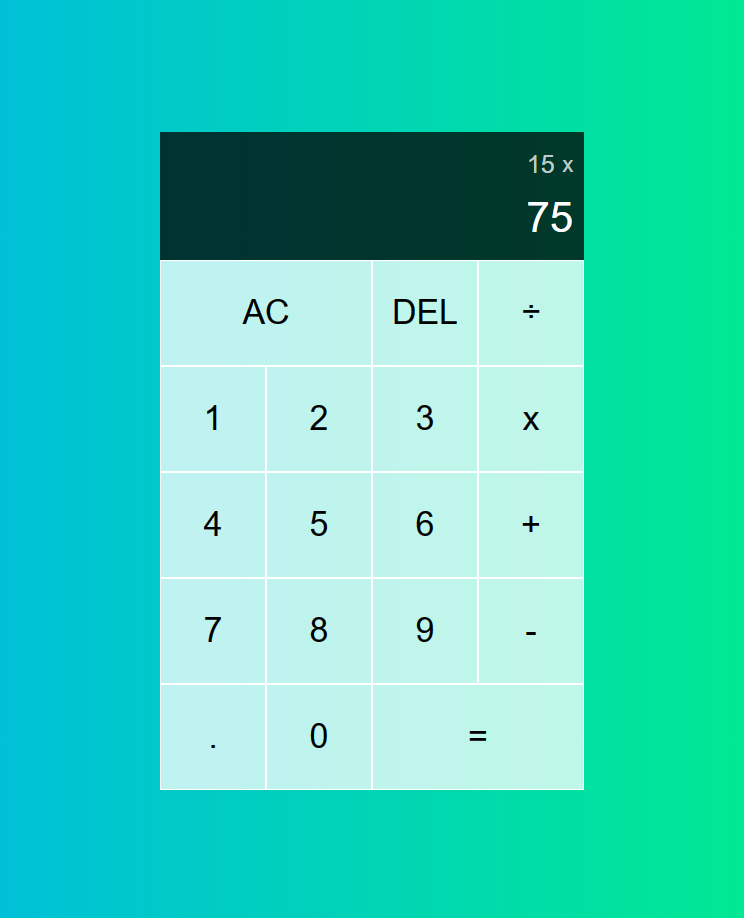

## Calculator with Object-Oriented-Programing  [-view on Netlify](https://mrtozbk-calculator-oop.netlify.app/)

This is a simple calculator application built using Object-Oriented Programming (OOP) principles in JavaScript.

## Features

- Addition, subtraction, multiplication, and division operations
- Decimal point support
- Clear and delete functionalities
- Keyboard support



## Installation

To use this calculator app, simply download or clone the repository to your local machine.

```
git clone https://github.com/Muratozbk/Calculator-App-Project.git
```

## Usage

To use the calculator app, open the `index.html` file in your web browser. You can perform calculations using either the on-screen buttons or your keyboard. Here are the keyboard shortcuts:

- `0-9` - Enter numbers
- `.` - Enter decimal point
- `+` - Addition
- `-` - Subtraction
- `*` - Multiplication
- `/` - Division
- `Enter` or `=` - Calculate result
- `Backspace` - Delete the last character
- `C` or `Escape` - Clear the input

## Development

This calculator app was built using HTML, CSS, and JavaScript. The JavaScript code is structured using Object-Oriented Programming (OOP) principles, with a `Calculator` class that handles the calculations.

## License

This project is licensed under the MIT License - see the [LICENSE](LICENSE) file for details.

## Acknowledgments

- This calculator app was inspired by the [JavaScript Simplified Calculator project](https://courses.webdevsimplified.com/view/courses/javascript-simplified-advanced) on JavaScript Simplified.
